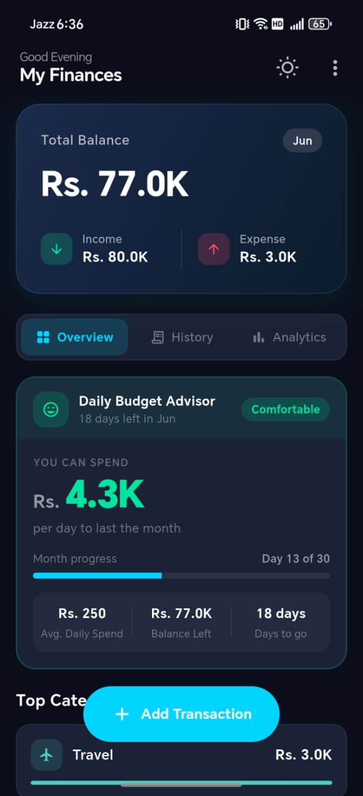
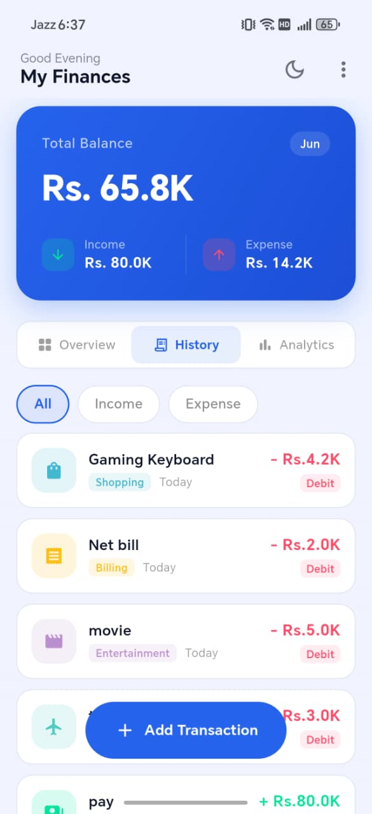
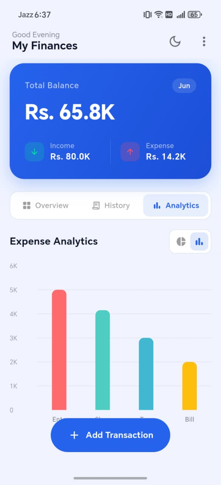
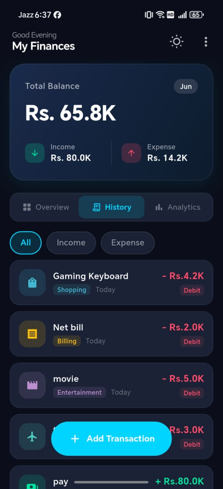

# Spendly — Flutter Expense Tracker

Offline-first personal finance tracker. Log income and expenses, visualise spending by category, and get a smart daily budget advisory — all stored locally with no account required.

---

## Screenshots

<table>
  <tr>
    <td align="center"><br/>Overview (Light)</td>
    <td align="center"><br/>History (Light)</td>
    <td align="center"><br/>Analytics (Light)</td>
  </tr>
  <tr>
    <td align="center"><br/>Overview (Dark)</td>
    <td align="center"><br/>History (Dark)</td>
    <td align="center"><br/>Analytics (Dark)</td>
  </tr>
</table>

---

## Features

| Feature | Detail |
|---|---|
| Income & Expense logging | Add, edit, swipe-to-delete transactions |
| 6 expense categories | Food, Travel, Shopping, Billing, Entertainment, Other |
| 3 income categories | Salary, Bonus, Other Income |
| Balance overview | Real-time total, monthly income vs expense breakdown |
| Daily budget advisor | Calculates how much you can spend per day to last the month |
| Spending analytics | Pie chart and bar chart with per-category breakdowns |
| Transaction history | Filterable list (All / Income / Expense), sorted newest first |
| Dark / Light / System theme | Toggle from the app bar, persists across sessions |
| Fully offline | No network, no account — everything in Hive on-device |

---

## Project structure

```
lib/
  main.dart                          ← App entry, Hive init, theme state, orientation lock
  models/
    transaction_model.dart           ← HiveObject: title, amount, category, date, isIncome
    transaction_model.g.dart         ← Generated Hive type adapter
  services/
    hive_service.dart                ← Static CRUD wrapper around the 'transactions' box
  screens/
    dashboard_screen.dart            ← Main hub: Overview / History / Analytics tabs
    add_transaction_screen.dart      ← Add & edit form with type toggle and category picker
  widgets/
    transaction_card.dart            ← Swipeable card (left = edit, right = delete)
    daily_budget_widget.dart         ← Smart budget status with 5-level advisory system
    chart_widget.dart                ← Pie ↔ Bar chart toggle, powered by fl_chart
  theme/
    app_theme.dart                   ← Full Material 3 light/dark ThemeData definitions
assets/
  images/
    logo.png                         ← App launcher icon
```

---

## Setup

### 1. Install dependencies

```bash
flutter pub get
```

### 2. Generate Hive adapters

The `transaction_model.g.dart` adapter is committed, but if you change the model, regenerate it:

```bash
dart run build_runner build --delete-conflicting-outputs
```

### 3. (Optional) Regenerate launcher icons

```bash
dart run flutter_launcher_icons
```

### 4. Run

```bash
flutter run
```

---

## How it works

### Data flow

```
Hive box: 'transactions'
         │
         ▼
  TransactionModel  (typeId: 1)
  ┌─────────────────────────────┐
  │ title    String             │
  │ amount   double             │
  │ category String             │
  │ date     DateTime           │
  │ isIncome bool               │
  └─────────────────────────────┘
         │
         ▼
  HiveService  (static CRUD)
  addTransaction / deleteTransaction / getTransactions
         │
         ▼
  DashboardScreen
  ValueListenableBuilder → rebuilds on every box change
    ├── Overview tab   → balance card, daily budget, top categories, recent list
    ├── History tab    → filterable full transaction list
    └── Analytics tab  → ChartWidget (pie / bar)
```

### Daily budget advisory

The `DailyBudgetWidget` calculates:

```
daily_budget    = remaining_balance / days_remaining_in_month
avg_daily_spend = total_expenses / days_passed

Status:
  daily_budget ≤ 0                   → Over Budget   (red)
  daily_budget < 50% of avg_spend    → Tight          (red)
  daily_budget < avg_spend           → Be Careful     (amber)
  daily_budget < 150% of avg_spend   → On Track       (cyan)
  daily_budget ≥ 150% of avg_spend   → Comfortable    (green)
  no spend data yet                  → No Data Yet    (cyan)
```

---

## Key dependencies

| Package | Purpose |
|---|---|
| `hive` + `hive_flutter` | Offline NoSQL database, reactive box listeners |
| `fl_chart` | Pie chart and bar chart visualisations |
| `hive_generator` + `build_runner` | Code-gen for Hive type adapters |
| `flutter_launcher_icons` | Adaptive app icon generation |

---

## Category reference

| Category | Type | Color |
|---|---|---|
| Food | Expense | Red |
| Travel | Expense | Teal |
| Shopping | Expense | Blue |
| Billing | Expense | Amber |
| Entertainment | Expense | Purple |
| Other | Expense | Purple |
| Salary | Income | Green |
| Bonus | Income | Cyan |
| Other Income | Income | Purple |

---

## Building a release APK

```bash
flutter build apk --release --split-per-abi
```
